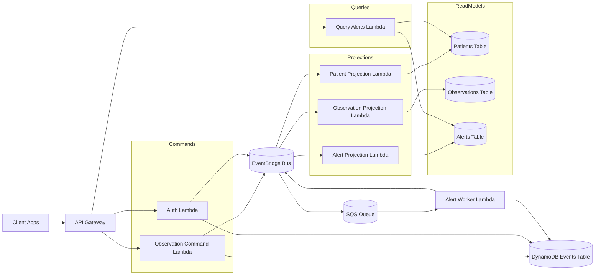

# HealthFlow AWS Demo

This project demonstrates a minimal event-driven backend architecture on AWS using serverless components. The entire stack runs locally using [LocalStack](https://github.com/localstack/localstack), allowing the system to be deployed and tested without accessing real AWS account.

## Demo Video

A short walkthrough of the system architecture and demo flow:

[](https://youtu.be/m2BKqSzuIFc)

# Architecture

Commands are handled by Lambda functions which generate **domain events**.
These events are stored in DynamoDB and distributed through **EventBridge** to projections and asynchronous workers.

## Architecture Diagram



## Project Structure

```
healthflow-aws
│
├── infra
│   ├── bin
│   │   └── healthflow.ts
│   └── lib
│       └── healthflow-stack.ts
│
├── services
│   ├── auth
│   ├── alert_worker
│   ├── authorizer
│   ├── observation_command
│   ├── projection_alert
│   ├── projection_patient
│   ├── projection_observation
│   ├── query_alerts
│   └── shared
│
├── frontend
│   ├── patient
│   └── clinician
│
└── tools
```

## Infrastructure (AWS CDK)

Infrastructure is defined using **AWS CDK with TypeScript** in `infra/lib/healthflow-stack.ts`.

The CDK stack creates:

* API Gateway
* Lambda functions
* EventBridge bus
* SQS queue
* DynamoDB tables

## 💡 Example Event Flow

Example scenario: a patient submits an observation.

1. Patient sends `POST /observations`
2. **API Gateway** invokes `ObservationCommand` Lambda
3. Lambda creates an **ObservationSubmitted** event
4. Event is stored in **DynamoDB event store**
5. Event is published to **EventBridge**
6. EventBridge distributes the event to:
   * Observation projection
   * SQS queue
7. **Alert worker** processes the observation asynchronously
8. If a threshold is exceeded, an **AlertCreated** event is generated
9. Alert projection updates the **alerts read model**
10. Clinician retrieves alerts via `GET /alerts`

# Key Components

## API Gateway

Public HTTP entry point for the system.
API Gateway routes requests to Lambda functions.

Endpoints:

```
POST /login
POST /observations
GET /alerts
```

## CQRS + Event Sourcing

Command and query responsibilities are separated.
Commands generate domain events which are stored in the DynamoDB event store and published to EventBridge.
Events stored in DynamoDB form the immutable event log of the system.
All projections and read models are derived from this event stream and can be rebuilt by replaying stored events.

```
POST /observations
  -> ObservationCommand Lambda
  -> ObservationSubmitted event
  -> stored in events DynamoDB table
  -> published to EventBridge
```

Projections build read models used by queries:
```
GET /alerts
  -> QueryAlerts Lambda
  -> alerts read model from DynamoDB
```

## Lambda Microservices

Each service is implemented as a small Python Lambda (`./services/`).
Each Lambda is focused on a single responsibility.

| Lambda                 | Purpose                               |
| ---------------------- | ------------------------------------- |
| auth                   | user login and patient creation       |
| observation_command    | handles observation submission        |
| alert_worker           | evaluates observations asynchronously |
| projection_patient     | builds patient read model             |
| projection_observation | builds observation read model         |
| projection_alert       | builds alert read model               |
| query_alerts           | returns alerts for clinicians         |

## Shared Library

The `services/shared` module contains reusable helpers used by multiple Lambdas.

| Module   | Purpose                              |
| -------- | ------------------------------------ |
| aws      | boto3 helpers and LocalStack support |
| auth     | JWT token creation and validation    |
| events   | event building and publishing        |
| request  | API Gateway request parsing          |
| response | API Gateway response formatting      |
| config   | environment configuration            |

## DynamoDB

Tables used in the system:

```
healthflow-events
healthflow-users
healthflow-patients
healthflow-observations
healthflow-alerts
```

Roles:

* **events table** - event store
* **users table** - authentication user data
* **patients / observations / alerts** - read models

## EventBridge

Central event bus used for distributing domain events.

Example events:

```
PatientCreated
ObservationSubmitted
AlertCreated
```

## SQS

SQS is used for **asynchronous processing**.
This allows long-running logic to be processed outside of the request path.

Example flow:

```
ObservationSubmitted -> EventBridge -> SQS -> Alert Worker
```

# Installation

## Prerequisites

* Python 3.11+
* Docker
* Node.js + npm
* AWS CLI
* awscli-local (`awslocal`)
* LocalStack CLI (`localstack`, `cdklocal`)

LocalStack runs AWS services locally using Docker containers.
The helper tools `awslocal` and `cdklocal` are used by the project scripts in `./tools/`.

## Running

The project includes helper scripts in `./tools/` that start the entire local environment. `deploy.sh` script performs the following steps:

1. Reset LocalStack containers
2. Start LocalStack with Docker
3. Deploy AWS infrastructure using CDK
4. Seed demo user data (`clinician`)
5. Start the frontend applications

Run:

```bash
./tools/deploy.sh
```

### After startup:

| Service              | URL                          |
| -------------------- | ---------------------------- |
| Patient UI           | http://localhost:5173        |
| Clinician UI         | http://localhost:5174        |
| LocalStack Dashboard | https://app.localstack.cloud |

### Demo Credentials

A demo clinician user is seeded automatically.

```
username: clinician1
password: demo
```
